# Maintaining Logs Using EFK (Elasticsearch, Fluentd, Kibana) in Kubernetes
## Abstract 
Cloud computing and storage has become a huge part of every industry and big company in today’s world. The services of a cloud, which contains large storage and huge processing power is preferred by every major organization since it helps them to expand their business, save money and reduce hassle. However, with more and more demand for cloud computing, the number of users and applications is increasing and thus, the possibility of errors and anomalies too. Kubernetes is a highly distributed system that helps manage the life cycle of hundreds of containers deployed in pods. The various parts of Kubernetes are dynamic and a Kubernetes environment that is implemented has a number of systems containing clusters and nodes that are being continuously created and destroyed on the basis of workloads. 
It is evident that here we are dealing with a very big pool of containerized applications and workloads. Hence, it is very important to be alert and proactive in Kubernetes monitoring and debugging errors. The various errors can be seen at any of the container, node or cluster levels. This brings forth the concept of logging. To monitor and manage services and infrastructure, Kubernetes’ logging mechanism plays a very important role. The logging done in this project creates logs that help in tracking errors and also to enhance the performance of containers that host applications. While storing and retrieving data from the cloud, it is essential to manage a log system.  Log analysis gives us valuable insights into critical business events which need to be properly managed. The logging done in this project makes use of an EFK stack (Elasticsearch, Fluentd, Kibana).

# INDEX 
                             * Chapter 1: Introduction 
                                       1.1 Introduction
                                       1.2 Motivation
                                       1.3 Problem Definition
                                       1.6 Relevance of the Project
                                       1.7 Methodology employed for development

                             * Chapter 2: Literature Survey 
                                       2.1 Research Papers Referred
                                           a. Abstract of the research paper 
                                           b. Inference drawn 
                                       2.2 Patent search

                             * Chapter 3: Requirement Gathering 
                                       3.1 Functional Requirements
                                       3.2 Non-Functional Requirements
                                       3.3.Constraints
                                       3.4. Hardware, Software, Technology and tools available
                                       3.5 System Block diagram

                             * Chapter 4: Proposed Design 
                                       4.1 System Design
                                       4.2 Detailed Designs
                                       4.3 Project Scheduling & Tracking using Timeline / Gantt Chart

                             * Chapter 5: Implementation Details 
                                       5.1. Methodology employed
                                       5.2. Algorithms used
                                       5.3 Screenshots (GUI) of project

                             * Chapter 6: Result Analysis 
                                       6.1. Evaluation measures
                                       6.2. Input parameters considered
                                       6.3 Comparison with the existing systems
                                       6.4 Inference Drawn

                             * Chapter 7: Conclusion 
                                       7.1 Limitations
                                       7.2 Conclusion
                                       7.3 Future Scope

                             * 8. References 
                                       8.4. Research Papers Referred
                                       8.5. Patents Referred      

# Chapter 1 

# Introduction 

## 1.1 Introduction to the project 
With increasing demand for cloud computing services, a system that takes care of the various errors at various levels of the cloud infrastructure has gained a lot of importance. The answer to this is most evidently a well built and efficient logging system. Cloud storage allows users to store data in an off-site location. This data can then be accessed through the public internet or a dedicated private network connection. While storing and retrieving data from the cloud, it is essential to manage a log system.
Our project aims to develop a logging system that makes use of an EFK stack (Elasticsearch, Fluentd, Kibana). The log system would prove to be vital while storing and retrieving data from the cloud. The disappearance of log data when a server is destroyed is a major issue for every system. Hence, we have built a system to maintain logs that would overcome these issues and provide a log analysis feature to the user. 

## 1.2 Motivation 
Data is an invaluable resource for any organization. Every organization has to maintain a large amount of data. This data is important for the organization as well as the customers of the organization. Hence it becomes very important to create a logging system. This log data is a very important resource for managing, maintaining and troubleshooting systems. 
Thus our project takes up the task of maintaining logs and providing a log analysis feature to the user. In the current log system available in cloud computing logs are available, however during any issue or tracing of a problem these logs need to be checked manually which can be very expensive and a lot of key data can be missed. Thus our cloud logging and management is aimed at automating log documentation,  data aggregation, incident alerting and other processes involved.                                                                                                                                                                    
## 1.3 Problem Definition 
Cloud Computing is state of the art concept that is helping many organizations to expand their business. This technology has enabled organizations to save money and reduce hassle. Cloud storage allows users to store data in an off-site location. This data can then be accessed through the public internet or a dedicated private network connection. While storing and retrieving data from the cloud, it is essential to manage a log system.  Log analysis gives us valuable insights into business-critical events which need to be properly managed. The logging challenge is the disappearance of log data when a server is destroyed. Therefore, we are proposing a system to maintain a log system with Elasticsearch, Fluentd and Kibana to provide log analysis features to the user.

## 1.4 Relevance of the Project 
Cloud computing is an invaluable aid to the various organizations that maintain large records of data and processing. It helps these organizations save money and expand easily. However, with increasing use of cloud computing, the number of users and applications is increasing and thus, the possibility of errors too. This brings forth the importance of the concept of logging.
To monitor and manage services and infrastructure, Kubernetes’ logging mechanism plays a very important role. The logging done in this project creates logs that help in tracking errors and also to enhance the performance of containers that host applications. It also provides valuable insights into critical events that need to be properly managed. This task if done manually becomes very tedious and almost impossible with large amounts of data. It could also lead to errors and loss of critical information. Hence our project automates all these tasks.

## 1.5 Methodology
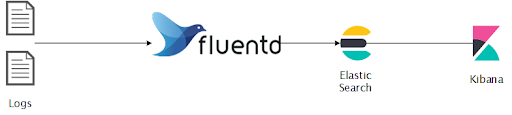
 
Fig 1. Basic View of EFK Stack

When running multiple services and applications on a Kubernetes cluster, a centralized, cluster-level logging stack can help you quickly sort through and analyze the heavy volume of log data produced by your Pods. An EFK stack (Elasticsearch, Fluentd, Kibana) is the most popular centralised logging solution. 
The following are the components of the EFK stack that has been used :
Elasticsearch -
Elasticsearch is a highly scalable open-source full-text search and analytics engine. It allows us to store, search, and analyze big volumes of data quickly and in near real time. It acts as a real, distributed and scalable search engine. It is commonly used to index and search through large volumes of log data, but can also be used to search many different kinds of documents.
Fluentd - 
Fluentd is an open source data collector which lets us unify the data collection and consumption for a better use and understanding of the data. Fluent is used to collect, transform and ship log data to the Elasticsearch backend. It is set up on Kubernetes nodes to tail container log files, filter and transform the log data, and deliver it to the Elasticsearch cluster, where it will be indexed and stored. It is used to aggregate event logs from all nodes, projects and pods into Elasticsearch.
Kibana -
Kibana is an open source analytics and visualization platform. It is a powerful data visualization front end and dashboard for Elasticsearch. Kibana allows you to explore your Elasticsearch log data through a web interface, and build dashboards and queries to quickly answer questions and gain insight into your Kubernetes applications. We can use Kibana to search, view and interact with data stored in Elasticsearch indices. 
We have used a minimal logging architecture that consists of a single logging agent Pod running on each Kubernetes worker node. The process starts by configuring and launching a scalable Elasticsearch cluster, and then creating the Kibana Kubernetes Service and Deployment. The logging architecture we have used here consists of 3 Elasticsearch Pods, a single Kibana Pod, and a set of Fluentd Pods rolled out as a DaemonSet. Ultimately, we have set up Fluentd as a DaemonSet so it runs on every Kubernetes worker node. 
In this way, the entire setup and implementation of the logging process is done.  

# Chapter 2 
# Literature Survey 
## 2.1 Research Papers Referred 
### R1. Yang, Kaichuang. (2016). Aggregated Containerized Logging Solution with Fluentd, Elasticsearch and Kibana. International Journal of Computer Applications. 150. 29-31. 10.5120/ijca2016911479.
     
Abstract :
The paper proposes a system which combines Fluentd, Elasticsearch and Kibana which enables the deployment and management of multiple containers for log reviewing. Aggregated logging updates the logging API while adding the following main components to the system: a node agent, a log aggregator, a log aggregator proxy, and visualization interface. These components work together to transfer logs from a volatile store on individual nodes in the cluster to a central location for backup and storage. Each component is configured and designed to operate in the cluster’s multitenant environment.

Inference :
The main components named the node agent, the log aggregator, the log aggregator proxy and the visualization interface are used in the logging process, which transfer logs from a volatile store to a central location. Aggregated logging updates the API.

### Qi, Guanqiu & Tsai, Wei-Tek & Li, Wu & Zhu, Zhi-Qin & Luo, Yong. (2017). A   cloud-based triage log analysis and recovery framework. Simulation Modelling Practice and Theory. 77. 292-316. 10.1016/j.simpat.2017.07.003. 
Abstract - 
The system proposes a new log model that classifies and analyses the interactions of services and detailed logging information during workflow execution. A workflow analysis technique is used to fast resolve production failures and assist failure recoveries. The failed workflow is reconstructed from failures in real time production servers by proposed log analysis solution. 

Inference - 
Classification and analysis of interactions of services is done during the workflow execution itself.  Detailed logging information is also provided using the same method and in the same workflow execution.

### Patrascu, Alecsandru. (2012). Logging System for Cloud Computing Forensic Environments. Control Engineering and Applied Informatics. 

Abstract: 
Cloud computing represents a rather new technology and a different paradigm in the field of distributed computing that involves more and more researchers. We can see in this context the need to know exactly where, when and how a piece of data is processed or stored. Compared with classic digital forensic, the field of cloud forensic poses a lot of difficulties since data is not stored on a single storage unit and furthermore it involves the use of virtualization technologies.

Inference:
Unlike other fields of distributed computing, cloud computing puts up new and different types of challenges. These are concerned with the analysis of large amounts of data. This paper provides a model that counters the problems of log data arriving in an asynchronous manner, which otherwise would be very difficult to handle. It also automates a lot of the processes involved.

### A Survey On: 'Log Analysis With Elk Stack Tool' - IJRAR - International Journal of Research and Analytical Reviews (IJRAR), E-ISSN 2348-1269, P- ISSN 2349-5138, Volume.6, Issue 4, Page No pp.965-968, November-2019

Abstract: 
Here, the main aim of the paper was to cover the survey on abnormality detection in log analysis. This paper provides information which gives the knowledge about tools for log analysis like ELK Stack tool as well as different scenarios of where to use log analysis. ELK stack is a combination of Elasticsearch which accepts the raw data to form different indexes, Logstash which is used to collect the logs and Kibana is used for visualization purposes.

Inference :
Like EFK that is being used in our project, the above paper analyses various other options that can be used in logging and log analysis. It provides an overall survey of all such possible methods and explains various components of an ELK stack that includes Elasticsearch, Logstash and Kibana.

## 2.2 Patent Search 
### “Managing Application Log Levels in Cloud Environment” - Vladimir Pavlov, Hristo Kostov, Hristo Iliev, Petar Zhechev, Verzhiniya Noeva - SAP SE - US9569328B2, USA - 29-05-2014.
Abstract - 
Applications and their application components run on a cloud platform and an underlying cloud runtime infrastructure. The cloud platform provides a service that exposes an interface to remotely change log levels of logger objects defined in application components. The application logs are generated and stored for the application components on the cloud runtime infrastructure of the cloud platform. Log levels affect the content stored in the application logs. The exposed interface is instantiated to process remote requests for managing application logs and log levels for a specified application component. The application component is deployed on the cloud platform. The requested change in the log levels is performed based on the implementation of the interface. The change in the log levels is performed in the configuration data on the cloud runtime infrastructure provided by the cloud platform.

### “Log Analytics for Problem Diagnosis” - Yaoping Ruan, Byungchul Tak, Shu Tao - International Business Machines Corp - US20160124823A1, USA - 05-05-2016.
Abstract - 
In a set of problem log entries from a computing system, a subset of the set of problem log entries are identified, which pertain to a failed request. The subset is compared to a reference model which defines log entries per request type under a healthy state of the computing system, to identify a portion of the subset of problem log entries which deviate from corresponding log entries in the reference model. In the portion of the subset, at least one high-value log entry is identified. At least one high-value log entry is output.

# Chapter 3 
## Requirements Gathering 
## 3.1 Functional Requirements 
1. A user should be able to access the Kubernetes dashboard.
2. The user should be able to access the environment without having to set any path variables or any additional configuration changes in the system
3.  The user should be able to easily visualise the data using the Kibana component.
4. The user should be able to scale up or scale down with ease without affecting the working of the environment.
5.  Any user should be able to collect, transform and ship log data to the Elasticsearch backend.
7.  Automation of the entire process of logging and managing and maintaining logs should be achieved.
8.  Ensuring that log data doesn’t disappear even when a server is destroyed.

## 3.2 Non-functional Requirements 

 Privacy of information, the export of restricted technologies, intellectual property rights, etc. should be audited. 
The software should be portable. So moving from one computer to another computer does not create any problem. 
It should be robust i.e it should be secure from various cyber threats.
All the services must be available at all times. Availability is a key factor for users who may use the resources at any point in the day. 
The system should be easy to use and access. 
It should be user-friendly and must have instructions on how to load the pre-prepared images on any Virtual machine manager. 
Performing various experiments should be easy and beginner friendly.
There must be recoverability. 

## 3.3 Constraints 

Users need a high computing power machine to be able to make use of such a logging based system.
The logging can be done only with the help of Kubernetes. So the users need continuous access to Kubernetes and its dashboard, without which this entire process is not possible.

## 3.4 Hardware and software requirements 

Hardware Requirements 
● Intel Processor i3 and above 
● RAM 4GB/8GB(recommended) 
● Hard disk 1TB 
Software Requirements 
Windows 8 or above 
Google Chrome Web Browser 
Kubernetes
Docker
Elasticsearch
Fluentd
Kibana

## 3.5 System Block Diagram 
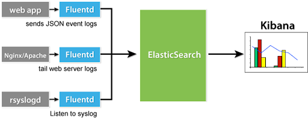
 

Fig 2. Block Diagram of the EFK 

### Elasticsearch:
Elasticsearch is a highly scalable open-source full-text search and analytics engine. It allows us to store, search, and analyze big volumes of data quickly and in near real time.

### Fluentd:
Fluentd is an open source data collector, which lets us unify the data collection and consumption for a better use and understanding of data. Once deployed it uses Fluentd to aggregate event logs from all nodes, projects, and pods into Elasticsearch (ES).

### Kibana:
Kibana is an open source analytics and visualization platform designed to work with Elasticsearch. We can use Kibana to search, view, and interact with data stored in Elasticsearch indices.

# Chapter 4: 
## Proposed Design 
## 4.1 System Design
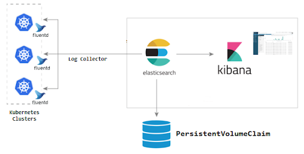
 
Fig 3.System Design

A log is a file that is produced automatically every time certain events occur in a system. Log management is an umbrella term that describes all the activities and processes used to generate, collect, and centralize massive volumes of computer-generated log data.
Log management tools are used to handle all the logs generated by apps, systems, networks, software, or users, and deal with them in any way that best suits the needs of an enterprise or organization. Log analysis is arguably one of the most important parts of log management because collecting and storing log data doesn’t make any sense if you are not to make use of it. Log management tools automate and simplify the process of log data analysis, providing advanced ways to present your findings.
Log management involves a set of processes and policies to govern large volumes of system-generated log messages in multiple forms—event logs, audit trails, application login records, etc. The primary concerns of web application owners are security, system operations, performance, and regulatory compliance. To conform to all these aspects and ensure all applications are behaving as expected, it’s essential to keep track of event and user activity logs. The diagram depicts the various tools which were used for log management. The following tools were used during the process:
Fluentd: It is used to unify logging layers. Fluentd pods to gather all of the logs that are stored within individual nodes in our Kubernetes cluster.
Elasticsearch: It is a distributed, free and open search and analytics engine for all types of data. Elasticsearch is the central component of the Elastic Stack, a set of free and open tools for data ingestion, enrichment, storage, analysis, and visualization.
Kibana: Now that we have our logs stored in Elasticsearch, the next step is to display them in Kibana. To do this, we will need to run Kibana in our cluster. Just as with Elasticsearch, we need only one Kibana instance

## 4.2 Detailed Design 
### Flowchart Diagram: 
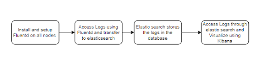
 
Fig 4. Flowchart of Maintaining Logs Using EFK  

### Use Case Diagram: 
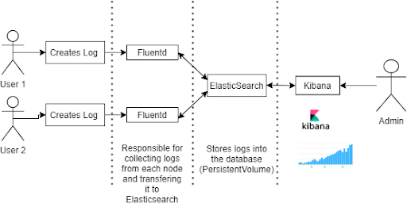
 

Fig 5. Use Case diagram of Maintaining Logs Using EFK 

## 4.3 Project Scheduling and Tracking using Gantt Chart 
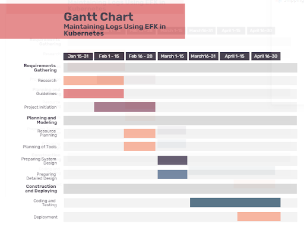
 

                                                      Fig 6. Gantt Chart 

# CHAPTER 5 
## Implementation Details 
## 5.1 Methodology applied
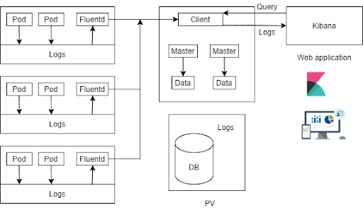
 
Fig 7. The EFK Stack

When running multiple services and applications on a Kubernetes cluster, a centralized, cluster-level logging stack can help you quickly sort through and analyze the heavy volume of log data produced by your Pods. An EFK stack (Elasticsearch, Fluentd, Kibana) is the most popular centralised logging solution. 
The following are the components of the EFK stack that has been used :
Elasticsearch -
Elasticsearch is a highly scalable open-source full-text search and analytics engine. It allows us to store, search, and analyze big volumes of data quickly and in near real time. It acts as a real, distributed and scalable search engine. It is commonly used to index and search through large volumes of log data, but can also be used to search many different kinds of documents.
Fluentd - 
Fluentd is an open source data collector which lets us unify the data collection and consumption for a better use and understanding of the data. Fluent is used to collect, transform and ship log data to the Elasticsearch backend. It is set up on Kubernetes nodes to tail container log files, filter and transform the log data, and deliver it to the Elasticsearch cluster, where it will be indexed and stored. It is used to aggregate event logs from all nodes, projects and pods into Elasticsearch.
Kibana -
Kibana is an open source analytics and visualization platform. It is a powerful data visualization front end and dashboard for Elasticsearch. Kibana allows you to explore your Elasticsearch log data through a web interface, and build dashboards and queries to quickly answer questions and gain insight into your Kubernetes applications. We can use Kibana to search, view and interact with data stored in Elasticsearch indices. 
We have used a minimal logging architecture that consists of a single logging agent Pod running on each Kubernetes worker node. The process starts by configuring and launching a scalable Elasticsearch cluster, and then creating the Kibana Kubernetes Service and Deployment. The logging architecture we have used here consists of 3 Elasticsearch Pods, a single Kibana Pod, and a set of Fluentd Pods rolled out as a DaemonSet. Ultimately, we have set up Fluentd as a DaemonSet so it runs on every Kubernetes worker node. 
In this way, the entire setup and implementation of the logging process is done.

## 5.2 Algorithms used 
Before we roll out an Elasticsearch cluster, we have to first create a Namespace into which we install all of our logging instrumentation. Kubernetes lets you separate objects running in your cluster using a “virtual cluster” abstraction called Namespaces. This Namespace will also allow us to quickly clean up and remove the logging stack without any loss of function to the Kubernetes cluster.
Once we create the Namespace, the next step is to create the Elasticsearch StatefulSet. create a headless Kubernetes service called elasticsearch that will define a DNS domain for the 3 Pods. A headless service does not perform load balancing or have a static IP. 
We define a Service called elasticsearch in the kube-logging Namespace, and give it the app: elasticsearch label. We then set the .spec.selector to app: elasticsearch so that the Service selects Pods with the app: elasticsearch label. When we associate our Elasticsearch StatefulSet with this Service, the Service will return DNS A records that point to Elasticsearch Pods with the app: elasticsearch label. We then set clusterIP: None, which renders the service headless. Finally, we define ports 9200 and 9300 which are used to interact with the REST API, and for inter-node communication, respectively.
The next step is to create the Kibana deployment and service. To launch Kibana on Kubernetes, we’ll create a Service called kibana, and a Deployment consisting of one Pod replica. You can scale the number of replicas depending on your production needs, and optionally specify a LoadBalancer type for the Service to load balance requests across the Deployment pods.
Next, we use the ELASTICSEARCH_URL environment variable to set the endpoint and port for the Elasticsearch cluster. Using Kubernetes DNS, this endpoint corresponds to its Service name elasticsearch. This domain will resolve to a list of IP addresses for the 3 Elasticsearch Pods. To learn more about Kubernetes DNS, consult DNS for Services and Pods.
Finally, we set Kibana’s container port to 5601, to which the kibana Service will forward requests.
Using the DaemonSet controller, we’ll roll out a Fluentd logging agent Pod on every node in our cluster. In Kubernetes, containerized applications that log to stdout and stderr have their log streams captured and redirected to JSON files on the nodes. The Fluentd Pod will tail these log files, filter log events, transform the log data, and ship it off to the Elasticsearch logging backend. In addition to container logs, the Fluentd agent will tail Kubernetes system component logs like kubelet, kube-proxy, and Docker logs. 
We create a Service Account called fluentd that the Fluentd Pods will use to access the Kubernetes API. We create it in the kube-logging Namespace and once again give it the label app: fluentd.

## 5.3 Screenshots of project (GUI) 
### Kubernetes Sign in page using token:
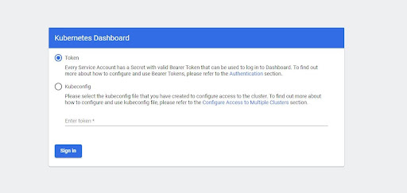
 

### Kubernetes Dashboard:
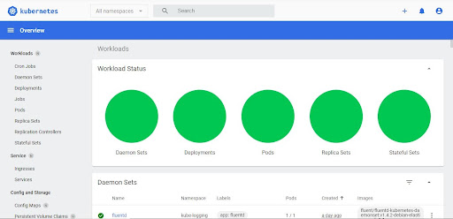
 

### Kibana Dashboard for Visualization of logs:
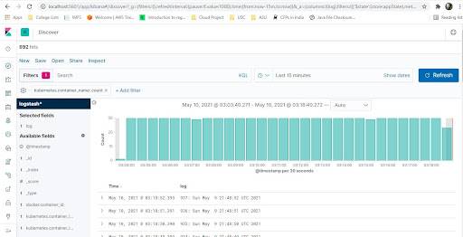
 

### ElasticSearch port forward:
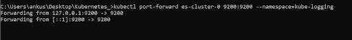
 

### Pods description in elasticsearch:
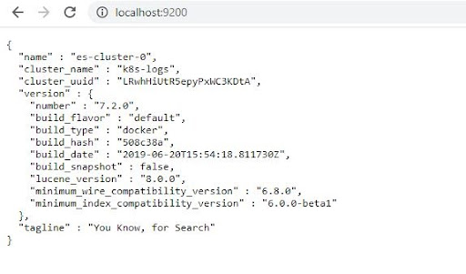
 

### Kibana Dashboard setup:

 

# Chapter 6: 
# Result Analysis 

## 6.1 Evaluation measures 

### 1) Effective time saved: 
This is the crux of the motive behind building this system. We intend to save as much time and effort as possible. The time required to perform the logging manually is sometimes large enough which might affect the overall efficiency in some ways, shape or form. In our case, we can take a survey of how much time it normally takes for the users to perform the logging in a manner that consists of doing it manually. This would help us calculate the effective time saved. 

### 2) Performance while working: 
We provide automation of the entire logging process. It is important to note that the logging otherwise would have to be done manually, which can lead to errors and important data being lost. Our aim would be to provide optimal performance in each environment so as to guarantee an automated, efficient and error-free logging environment for the users. These requirements can be tuned up in the future if a requirement arises. 

## 6.2 Input Parameters considered 
In our case, there’s not much on the input side as we are providing a system where we’ll be giving a made-up environment to the user to work upon. However certain things can be considered: 

### 1) Input lag(If any): If the workload goes way beyond the allocated hardware capabilities, chances are that the system might slow down and an input lag might be observed while typing and performing certain operations. 

### 2) Additional configurations: A user might perform certain additional configurations to the existing environments depending on the kind of work they are performing. These configurations need to be well suited with the system in order for the system to work properly. 

## 6.3 Comparison with existing systems 

In the current log system available in cloud computing, logs are already available. However during any issue or tracing of a problem, these logs need to be checked manually which can be very expensive and a lot of key data can be missed. Hence, our system automates this entire process of logging. This would not only save a massive amount of time but also reduce the human errors that occur in manual logging. This would prove to be vital in business-critical data related operations.

Another major problem is the log data arrives in an asynchronous manner making log analysis very challenging. Our system overcomes this by automating this logging process and making sure that log analysis is done in a timely manner and an efficient way.

## 6.4 Inference Drawn 
Considering the above parameters, we could see that our system performed as expected. We tried testing it under heavy circumstances and automated the logging process, which yielded results as expected. This does go on to prove that although this can be a solution for many of the logging problems faced by developers, there are certain aspects you have to consider while providing such a solution such as the hardware limitations, the high software requirements, etc. Nonetheless, this is a very efficient working prototype of a system that can be deployed to a large number of developers in order to save their time and effort which would otherwise have been wasted in continuously monitoring and maintaining the logging system. By automating the entire logging process, the manual errors are avoided and efficiency is provided in business-critical data related operations.

# Chapter 7: 
# Conclusion 
## 7.1 Limitations 
Our system adheres to people with machines that have relatively higher computing power. Failure to meet the basic software and hardware requirements might lead to instability of the system and certain errors. 
Implementation and design has been done on a relatively smaller scale (due to limitations of processing power) with only a 3-pod Elasticsearch cluster as well as a single Kibana pod. This however is not very useful in very large real world applications and a much larger system has to be built. 
The entire system has been developed on the Windows Operating Systems. If a user wishes to work in a different OS, ths same system and configuration would not work and a totally different process has to be followed for it. 
There are of course certain hardware limitations to our system since GCP allows usage of a certain amount of its hardware. 

## 7.2 Conclusion

Cloud computing is becoming a critical technology for every organization. However, managing and maintaining log data in an efficient manner is very important for the smooth running of any cloud system. Maintaining log data would help in keeping a track of errors and drilling down on any application related issues. Log data is invaluable for managing, maintaining and troubleshooting systems. 
The proposed system aims to build a logging system that would efficiently maintain a central repository for log collection in the cloud. The system is built using EFK (Elasticsearch, Fluentd, Kibana) in Kubernetes with the help of Docker. The system will automate the various logging tasks and management services like log documentation, data aggregation, incident alerting and other processes involved. This log analysis will give valuable insights in business-critical events which need to be properly managed.

## 7.3 Future Scope 
The system that we have designed efficiently works on log data and automates the various tasks involved. But the implementation and design has been done on a relatively smaller scale with only a 3-pod Elasticsearch cluster as well as a single Kibana pod. Only three worker nodes have been used and the cluster contains a managed control plane. However, these are relatively small configurations as compared to tasks in the real world. With the help of high computing power and better software and hardware, it will be possible to create a system that works well even for the demands of the real world applications.This would ensure better logging and an efficient method to scale up to more number of pods and implement the same project on a much larger scale.

# References 

# Research Papers Referred :

Aggregated Containerized Logging Solution with Fluentd, Elasticsearch and Kibana - Kaichuang Yang - International Journal of Computer Applications (0975 – 8887) - Volume 150 – No.3, September 2016.
A cloud-based triage log analysis and recovery framework - Qi, Guanqiu & Tsai, Wei-Tek & Li, Wu & Zhu, Zhi-Qin & Luo, Yong. (2017) - Simulation Modelling Practice and Theory - 77. 292-316. 10.1016/j.simpat.2017.07.003.
A Survey On: 'Log Analysis With Elk Stack Tool' - IJRAR - International Journal of Research and Analytical Reviews (IJRAR), E-ISSN 2348-1269, P- ISSN 2349-5138, Volume.6, Issue 4, Page No pp.965-968, November-2019.
Logging System for Cloud Computing Forensic Environments - Patrascu, Alecsandru - Control Engineering and Applied Informatics -  2012.07.03
Introduction to Kubernetes - Serjik Dikaleh, Ozair Sheikh, Chris Felix - CASCON '17: Proceedings of the 27th Annual International Conference on Computer Science and Software Engineering - November 2017 - Pages 310

# Patents Referred :
### “Managing Application Log Levels in Cloud Environment” - Vladimir Pavlov, Hristo Kostov, Hristo Iliev, Petar Zhechev, Verzhiniya Noeva - SAP SE - US9569328B2, USA - 29-05-2014.

### “Log Analytics for Problem Diagnosis” - Yaoping Ruan, Byungchul Tak, Shu Tao - International Business Machines Corp - US20160124823A1, USA - 05-05-2016.
